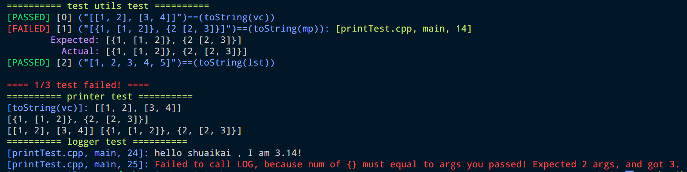

# utils

> Some simple but useful(maybe) utils.

- 打算做一些似乎有用的小工具，应当都是 Header Only
- 以一个工程的结构，附带上测试用例
- 采用 clang 系列工具，提供格式化、vscode 等配置文件

## 进度

- [x] printer: 集输出任意类型、打印日志、简单测试宏于一体的工具，详情参见文件头注释
- [ ] functionStyleUtils: 提供一些函数式编程的包装，拟模仿 java 的相关接口，如 Consumer、Provider、Function、Optional 等概念
- [ ] coroutineToy: 尝试封装一个协程玩具库

## 效果展示

### printer

